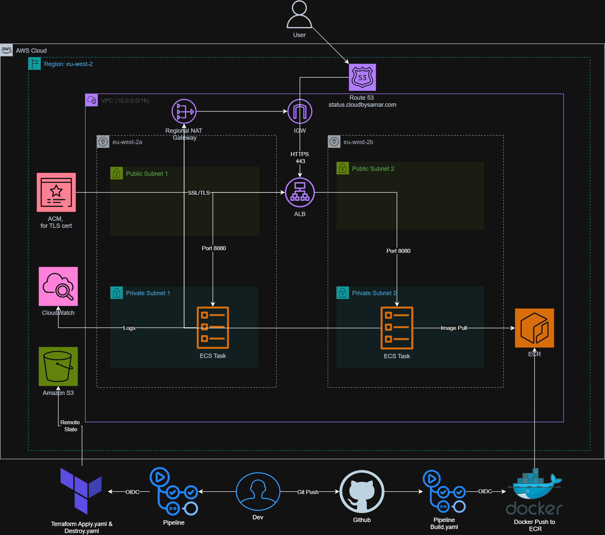
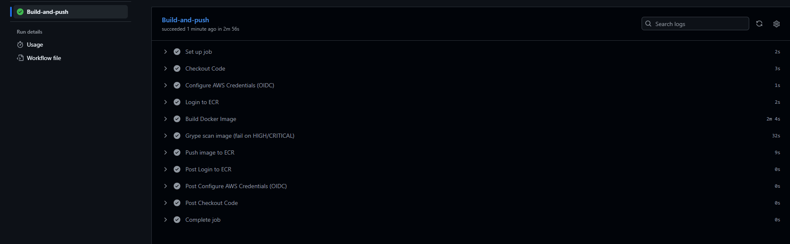
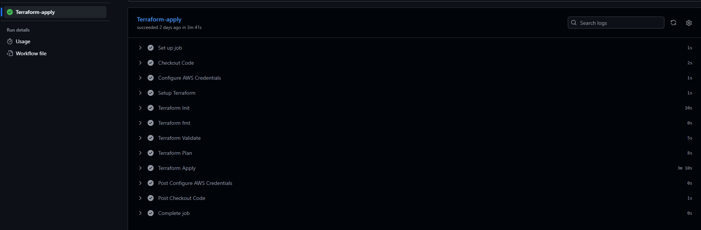
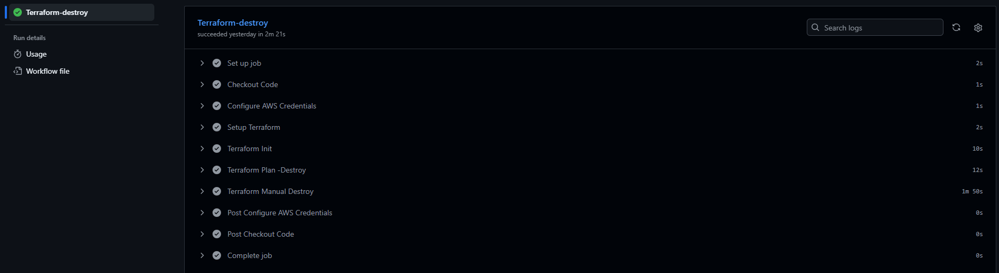

# Gatus Health Monitoring App | Deployed on AWS ECS Fargate

## Introduction
This project deploys Gatus onto AWS ECS Fargate. Gatus is an open source health 
monitoring dashboard that continuously monitors configured endpoints and displays 
their status in real time.

## Architecture Diagram



The infrastructure is fully provisioned using Terraform IaC across two 
availability zones for high availability, with three GitHub Actions CI/CD 
pipelines handling image builds, security scanning, and deployments. The 
application is containerised using Docker and served securely over HTTPS.

In this project Gatus is configured to monitor external endpoints and display 
their health status at status.cloudbysamar.com.


## App Demo


## Prerequisites

- AWS account with appropriate permissions
- Terraform installed (v1.0+)
- Docker installed
- AWS CLI configured
- A registered domain managed via Route53
- GitHub repository with the following secrets configured:
  - `AWS_ROLE_TO_ASSUME`: IAM role ARN for GitHub Actions OIDC authentication

## Project Structure
```
ecs-gatus/
├── .github/
│   └── workflows/
│       ├── build.yml
│       ├── apply.yml
│       └── destroy.yml
├── app/
│   └── gatus/
├── bootstrap/
│   ├── main.tf
│   ├── outputs.tf
│   ├── variables.tf
│   └── provider.tf
├── config/
│   └── config.yaml
├── docs/
├── infra/
│   ├── modules/
│   │   ├── vpc/
│   │   ├── sg/
│   │   ├── iam/
│   │   ├── alb/
│   │   ├── acm/
│   │   ├── route53/
│   │   └── ecs/
│   ├── main.tf
│   ├── variables.tf
│   └── provider.tf
├── .checkov.yaml
├── .dockerignore
├── .gitignore
├── .grype.yaml
├── Dockerfile
└── README.md
```

## Tech Stack

**Infrastructure & Cloud**
- AWS: VPC, ECS Fargate, ECR, ALB, ACM, Route53, CloudWatch, S3
- Terraform: Modular Infrastructure as Code (7 modules)

**CI/CD & Security**
- GitHub Actions
- OIDC for AWS authentication
- Grype for container image scanning
- Checkov for IaC security scanning

**Application**
- Gatus (Go/Golang)
- Docker (multi-stage build)

## Architecture Overview

- User requests hit Route53 which resolves status.cloudbysamar.com to the ALB via an alias record
- The ALB handles TLS termination using an ACM certificate and forwards traffic to Gatus containers on port 8080
- All workloads run in private subnets across two availability zones with the ALB as the only public entry point
- A regional NAT Gateway handles outbound traffic from private subnets so Gatus can reach external endpoints for health checks

### Docker Design
The Dockerfile uses a multi-stage build separating Go compilation from the Alpine runtime:
- Reduces final image size by over 65%
- Removes build dependencies from the production image
- Reduces attack surface with fewer packages
- Container runs as a non-root user (appuser) limiting blast radius of any potential vulnerability

### Private ECS Workloads
Placing ECS tasks in private subnets for security purposes:
- Prevents direct internet access to containers
- Forces all inbound traffic through the ALB
- Aligns with AWS well-architected framework best practices

### Application Load Balancer
The ALB serves as the sole public entry point:
- Routes traffic to ECS tasks across both availability zones
- Health checks container instances before routing traffic
- Terminates TLS using an ACM certificate

### Modular Terraform
Infrastructure is split across seven modules (vpc, sg, iam, alb, acm, route53, ecs):
- Each module is responsible for one part of the infrastructure
- Changes to one module don't affect others
- Remote State stored in S3 with State lock

### IAM & Least Privilege
- ECS task execution role scoped to only the permissions required to pull images 
  from ECR and write logs to CloudWatch
- GitHub Actions authenticates via OIDC using a dedicated IAM role, eliminating 
  the need for long-lived access keys

## CI/CD Pipelines

Three GitHub Actions pipelines automate the build, deployment and teardown process:

### build.yml
- Triggered automatically on push to main (path filtered to app, config and Dockerfile changes)
- Builds Docker image tagged with commit SHA
- Scans image for vulnerabilities using Grype (fails on HIGH/CRITICAL)
- Pushes image to ECR on successful scan



### apply.yml
- Manually triggered via workflow_dispatch (continuous delivery)
- Runs Checkov IaC security scan before applying
- Runs terraform fmt, validate, plan and apply
- Uses OIDC for secure AWS authentication
- Image tag passed automatically via TF_VAR_image_tag using commit SHA



### destroy.yml
- Manually triggered via workflow_dispatch with confirmation input
- Requires typing "destroy" to confirm before pipeline runs
- Runs terraform plan -destroy followed by terraform destroy



## How to Deploy

### 1. Bootstrap
Sets up the remote state backend and OIDC authentication:
```bash
cd bootstrap
terraform init
terraform apply
```

### 2. Configure GitHub Secrets
Add the following secret to your GitHub repository:
- `AWS_ROLE_TO_ASSUME`: IAM role ARN output from bootstrap

### 3. Build and Deploy
- Push a change to main to trigger the build pipeline automatically
- Once build succeeds, trigger the apply pipeline manually via GitHub Actions
- To tear down, trigger the destroy pipeline and type "destroy" to confirm

## Lessons Learned
- **OIDC Authentication**: More setup than static credentials but understanding the GitHub to AWS trust relationship made it worthwhile
- **CI/CD Debugging**: Most failures came from local assumptions: wrong file paths, Go version mismatches, missing submodule registration
- **Image Scanning**: CVEs appear faster than expected, maintaining a documented ignore file is an ongoing process not a one time setup
- **Terraform Bootstrap**: Separating the state backend and OIDC setup into a bootstrap layer taught me why foundational infrastructure needs to exist before anything else can be automated

## Future Improvements

- Replace the NAT Gateway with VPC endpoints for ECR and CloudWatch as the NAT 
Gateway is the most expensive component in this setup for what it actually does
- Add AWS WAF to the ALB to protect against common web exploits
- Implement blue/green or canary deployments via AWS CodeDeploy to reduce 
deployment risk and enable zero-downtime releases
- Introduce separate environments (dev, staging, production)
- Add branch protection rules on main to require pipeline success before merging
- Centralised observability stack with Prometheus and Grafana for metrics, dashboards and alerting alongside CloudWatch